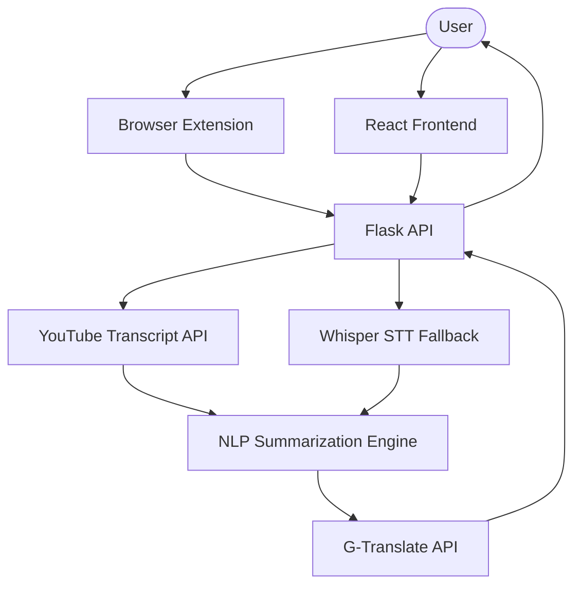

# YouTube Transcript Summarizer

[](https://user-images.githubusercontent.com/61548445/149874631-bc411249-2d05-4e0c-ac29-dfb93de78a82.png)

## 🚀 Project Overview
The **YouTube Transcript Summarizer** is a powerful tool designed to condense long YouTube videos into concise, readable summaries. In an era where online education is paramount, students and professionals often face lecture videos that are hours long. This project leverages Machine Learning (NLP) to provide high-quality summarization, saving time and improving productivity.

## 🛠️ Working Mechanism
The application follows a robust dual-path approach to ensure transcripts are always available:

1.  **Direct Transcript Fetching**: Initially, the system attempts to retrieve the official transcript using the `youtube-transcript-api`. This is the fastest method.
2.  **Universal Fallback (STT)**: If no transcript is available, the backend automatically:
    -   Downloads the audio using `yt-dlp`.
    -   Transcribes the audio to text using **OpenAI Whisper (Speech-to-Text)**.
3.  **Summarization & Translation**: The retrieved text is processed by a frequency-based NLP engine (`SpaCy` & `NLTK`) to extract key points. The summary is then translated into multiple languages (Hindi, Gujarati, etc.) using the Google Translate API.

## 🏗️ Architecture
The project structure is divided into three main components:

-   **Backend**: A Flask-based REST API that handles video processing, summarization, and translation.
-   **Frontend**: A React application providing a user-friendly interface to input URLs and view/download summaries.
-   **Browser Extension**: A Chrome extension that allows users to summarize videos directly while browsing YouTube.



## 💻 Tech Stack
-   **Backend**: Python, Flask, SpaCy, NLTK, Whisper (OpenAI), yt-dlp, imageio-ffmpeg.
-   **Frontend**: React.js, CSS3.
-   **Extension**: Javascript (manifest v3), HTML, CSS.

## ✨ Features
-   **Multi-Language Support**: Summaries available in English, Hindi, and Gujarati.
-   **STT Fallback**: Works on videos without captions using audio transcription.
-   **Text-to-Speech**: English audio summary generation.
-   **Downloadable Output**: Save summaries as text files for offline reference.
-   **Cross-Platform**: Accessible via web app or browser extension.

## ⚙️ Installation & Development

### 1. Clone the repository
```bash
git clone https://github.com/Dipendrakumar1/youtube-video-summarizer-app
cd youtube-video-summarizer-app
```

### 2. Backend Setup
1.  Navigate to the API folder:
    ```bash
    cd youtube-transcript-summarizer-api
    ```
2.  Create and activate a virtual environment:
    ```bash
    python -m venv venv
    .\venv\Scripts\activate  # Windows
    source venv/bin/activate # Linux/Mac
    ```
3.  Install dependencies:
    ```bash
    pip install -r requirements.txt
    ```
4.  (Optional) Create a `.env` file:
    ```env
    PORT=5001
    FLASK_DEBUG=False
    ALLOWED_ORIGINS=http://localhost:3000
    ```
5.  Run the API:
    -   **Development**: `python app.py` (with `FLASK_DEBUG=True`)
    -   **Production**: `python app.py` (with `FLASK_DEBUG=False`) or `gunicorn app:app` (on Linux).

### 3. Frontend Setup
1.  Navigate to the frontend folder:
    ```bash
    cd ../youtube-transcript-summarizer-frontend
    ```
2.  Install modules:
    ```bash
    npm install
    ```
3.  Create a `.env` file:
    ```env
    REACT_APP_API_URL=http://localhost:5001/api/
    ```
4.  Start/Build the app:
    -   **Development**: `npm start`
    -   **Production**: `npm run build`

## 🚀 Production Deployment

### 1. Backend on Render
1.  **Create New Web Service**: Connect your GitHub repository.
2.  **Root Directory**: Set to `youtube-transcript-summarizer-api`.
3.  **Environment**: select `Python`.
4.  **Build Command**: `pip install -r requirements.txt`
5.  **Start Command**: `gunicorn app:app` (Render often detects the `Procfile` automatically).
6.  **Environment Variables**:
    - `PYTHON_VERSION`: `3.10.12` (CRITICAL: Do not use 3.14 or greater).
    - `FLASK_DEBUG`: `False`.
    - `ALLOWED_ORIGINS`: `https://your-frontend-link.vercel.app`.
    - `PORT`: `10000`.

### 2. Frontend on Vercel
1.  **New Project**: Connect your GitHub repository.
2.  **Root Directory**: Set to `youtube-transcript-summarizer-frontend`.
3.  **Framework Preset**: `Create React App`.
4.  **Environment Variables**:
    - `REACT_APP_API_URL`: `https://your-backend-link.onrender.com/api/` (Add your Render URL here).
    - `NODE_OPTIONS`: `--openssl-legacy-provider` (REQUIRED for Node 17+ compatibility).
5.  **Deploy**: Vercel will automatically run `npm run build` and serve the files.

> [!TIP]
> Always deploy the **Backend first** to get the Render URL, then use that URL in the Frontend's `REACT_APP_API_URL` variable. Once the Frontend is deployed, go back to Render and update `ALLOWED_ORIGINS` with the Vercel URL to secure your API.

## 📝 Scope and Limitations
-   **Video Length**: The system handles videos of any length, though extremely long videos may take longer to process via STT.
-   **Captions**: Optimal performance is achieved on videos with existing high-quality transcripts.
-   **Hardware**: Whisper STT performs best on systems with CUDA-capable GPUs, but defaults to CPU.

## 🤝 Contributing
Contributions are what make the open-source community such an amazing place to learn, inspire, and create. Any contributions you make are **greatly appreciated**.

1. Fork the Project
2. Create your Feature Branch (`git checkout -b feature/AmazingFeature`)
3. Commit your Changes (`git commit -m 'Add some AmazingFeature'`)
4. Push to the Branch (`git push origin feature/AmazingFeature`)
5. Open a Pull Request

## 👤 Authors
-   **[@Dipendrakumar1](https://github.com/Dipendrakumar1)**
