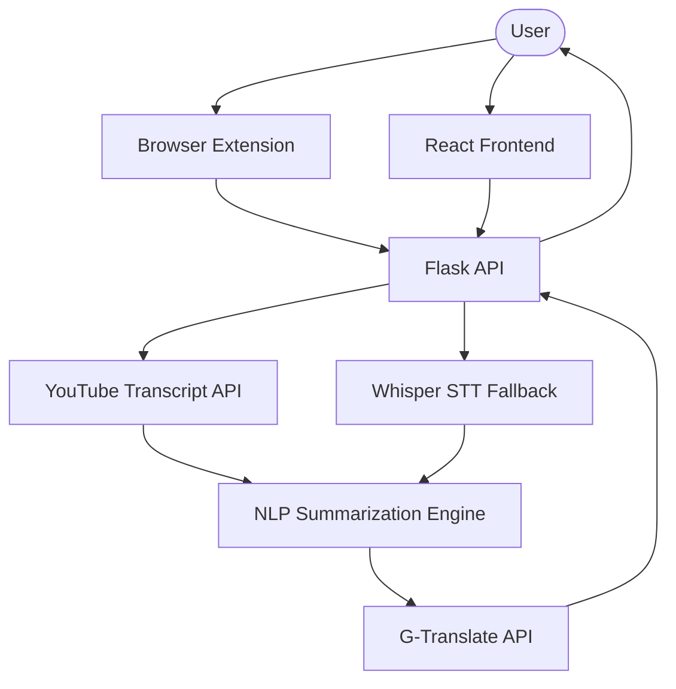

# Walkthrough: Comprehensive README.md Update

I have updated the project's `README.md` to provide a clear and professional overview of the YouTube Transcript Summarizer.

## Key Changes

### Content Enhancements
- **Application Overview**: Refined the description to highlight the utility of summarizing long educational videos.
- **Working Mechanism**: Added a detailed section explaining how the system retrieves transcripts (using `youtube-transcript-api`) or falls back to audio-to-text conversion (using `Whisper`).
- **Detailed Architecture**: Included a section describing the interaction between the React frontend, Flask API, and Machine Learning models.
- **Tech Stack**: Listed the core technologies used in each component (Backend, Frontend, and Browser Extension).
- **Features**: Expanded the feature list to include STT fallback and summarization in multiple languages.
- **Installation & Running**: Improved the steps for setting up both the backend and frontend.
- **Scope & Limitations**: Added context about transcript availability and processing requirements.

## Visualization of Architecture

## Verification Results

Verified that all mentioned file names (`app.py`, `model.py`, `requirements.txt`, etc.) and directory structures align with the actual codebase.
